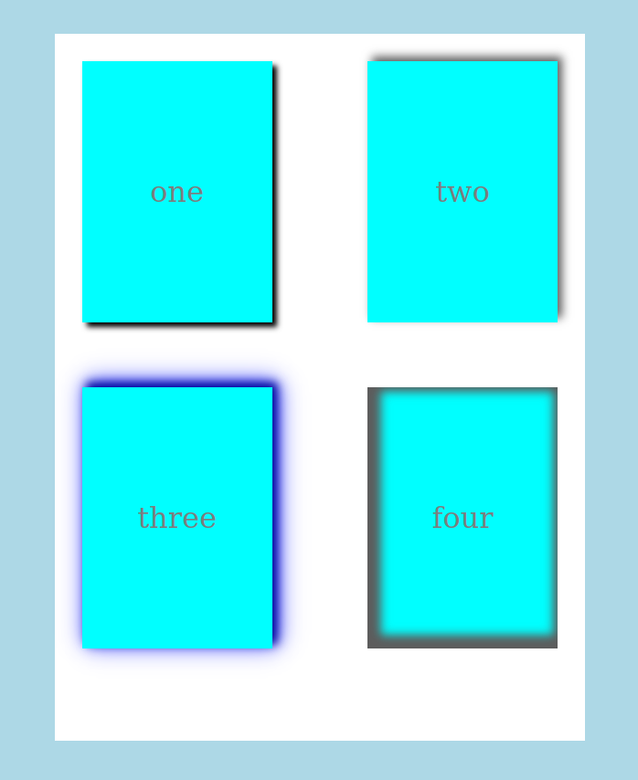

# BOX SHADOWS

- See provided html and css and read the comments
- Make the main centered in body
- Arrange children in main nicely
- Give each Shadow dive a shadow simliar to the picture
- After accomplishing that, Experiment with the shadows
- Add two google fonts you like one on all elements and another on a spesefic element
- Add text shadow to the element two h4 and an elevation effect to the text
- Try to use :nth-child() instead of id to select each child
- Finally change css so shadows are triggered for each child by hover effect

